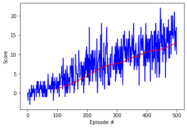
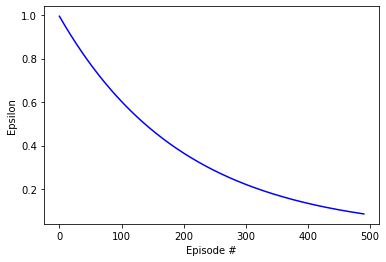
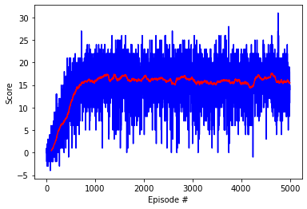

 
  <h3 align="center">Project 1 Navigation using DQN and Unity ML</h3>

<!-- TABLE OF CONTENTS -->

  
Table of Contents

  <ol>
    <li>
      <a href="#about-the-project">About The Project</a>
      <ul>
        <li><a href="#">Built With</a></li>
      </ul>
    </li>
    <li>
      <a href="#parameter-modified">Parameters modified</a>
      <ul>
        <li><a href="#prerequisites">Epsilon</a></li>
        <li><a href="#installation">Installation</a></li>
      </ul>
    </li>
    <li><a href="#usage">Usage</a></li>
    <li><a href="#roadmap">Roadmap</a></li>
    <li><a href="#epsilon-limits">Epsilon limits</a></li>
    <li><a href="#license">License</a></li>
    <li><a href="#contact">Contact</a></li>
    <li><a href="#acknowledgements">Acknowledgements</a></li>
  </ol>

## About The Project

## Variation of parameters on basis DQN 

First, we adapted the LunarLander-v2 agent and model from the  [DQN lesson at Udacity](https://youtu.be/MqTXoCxQ_eY).
The files can be downloaded from the  [RL nanodegree repository](https://github.com/udacity/deep-reinforcement-learning/tree/master/dqn).

The adaptation requires simply to change the OpenAI Gym environment by the Unity ML environment and adapt some of the parameters. The goal now is to achieve a value more than 13 as an average of the last 100 episodes, in less than 1800 episodes.

This is achieved easily by the original DQN around 500 episodes (498 +/- 18 for n=3). If leave the network going for a 5000 episodes, it will reach the optimal policy with an average around 15.5 as observerd in the figure 1.

<figure>

<figcaption><i>Figure 1. Evolution of rewards (score) for the first 500 episodes. The red line is the moving average over the last 100 episodes</i></figcaption>
 </figure>

Since the threshold for the goal has been already achieved, our goal would be now to achieve better results but with a fixed number of episodes (600). We could force also to learn faster and have as a metric the number of episodes. Since the first 100 episodes the network is still learning from 0, it is unlikely to achieve an average of 13 in the first 100 iterations, that sets up to achieving the average of 13 in a range between 100 to 500. 

In many real applications we have to decide between speed of learning or best reward results. In speed tradeoff, we can try to find a policy fixing a threshold in our goal, even if the policy is suboptimal, the goal is always reached. This is important when the robot has to adapt to changing scenarios in the environment and we have to continuosly retrain to update our policy. In the second, we don't care how long the training takes, then we froze the weights and use the agent. In deep learning, for long trainings we also need to account about potential overfitting and the amount of computational resources available. 

We are going to consider both metrics. But playing with multiple metrics is difficult, so we have to commit to a decision, in this case, that we will not train more than 500 episodes and observe which parameters maximize our gain.

In the following table a list with all parameters tested and its values is presented. Each parameter was modified and the environment run 3 times. It is important to have an idea about how much variance we get. Running the experiment one time would be fatal (we could just get lucky), that is why 3 times is an acceptable heuristic to decide if a change of parameter is good or not. In an real experimental scenario, we would repeat each run 30 times to get enough statistical power and be confident of the values of our variance, but at the moment, we are doing an exploration of the parameters space. 

The conditions for reproducing this table, as I said, were, 500 episodes, with a maximum of 300 steps per episode, 3 repetitions in total.  Parameters are:
-  _eps_ is the epsilon of the eps-greedy function (limits of start and end, 1.0 being total exploration, 0.0 fixed policy)
-  _eps\_decay_ is the decay rate for eps following the formula eps = max(0.01, eps*eps_decay), i.e., exponential decay   
- _Gamma_, discount rate for the reward, how many episodes we will remember
- _Tau_ is the parameter for soft update of the DQN network
- _Batch\_size_ of the network (amount of data trained in one iteration before doing gradient descent update)
- _lr_ is the learning rate of the gradient descent algorithm for the network
- _update_ is the number of iterations we wait until we update the secondary network of the DQN

<table>
  <tr>
    <th>&nbsp;</th>
    <th>Parameters</th>
    <th>Mean +/- std</th>
  </tr>
  <tr>
    <th>Vanilla DQN </th>
    <td>eps_start [1.0,0.01], eps_decay=0.995, batch_size = 64, gamma = .99, tau = 1e-3, lr = 5e-4, update=4, arch = 64x64</td>
    <td>12.75+/-0.4</td>
  </tr>
  <tr>
    <th>Architecture change</th>
    <td>64x64x128 </td>
    <td>13.34+/-0.03</td>
  </tr>
  <tr>
  <tr>
    <th>Epsilon Decay I</th>
    <td>eps_decay=0.992</td>
    <td>14.45+/-0.4</td>
  </tr>
  <tr>
    <td>Gamma decreased</td>
    <td>gamma = 0.95</td>
    <td>14+/-0.75</td>
  </tr>
  <tr>
    <td>Double DQN</td>
    <td>eps_start [1.0,0.01], eps_decay=0.992, batch_size = 64, gamma = .99, tau = 1e-3, lr = 5e-4, update=4, arch = 64x64x128</td>
    <td>14.91+/-0.36</td>
  </tr>
    <tr>
    <td>Dueling DQN</td>
    <td>-</td>
    <td></td>
  </tr>
</table>

### Comments to parameter changing
#### Network architecture
  The weights of the network are randomly initialized (it uses a random uniform distribution of mean 0 and variance close to 1, aka [He initialization] (https://arxiv.org/pdf/1502.01852.pdf).

 The architecture of the DQN is a Linear-Relu-Linear-Relu, with a linear output. The input is the state, the output the number of actions. 
 The number of units on each layer (node weights), is 64 each. Thus we have an architecture 37x64x64x4, all linear.

 The first trial was to vary the size of the input layers to 32 or 128 in the middle layers. 32 and 128 decreased the performance a little (12.37+/-0.36 and 12.47+/-0.91, respectively). Thus, we decided to add an additional layer. The combinations 32x64x128 (12.23+/-0.26), 64,32,64(12.6+/-0.1),  64x64x64(12.58+/-0.58) and 64x64x128(13.34+/-0.03) were tested.   

#### Epsilon limits
 Only if we are using an initialized network we would reduce the amount of exploration. In many experiments, the balance exploration-explotaiton is a delicate balance. In MC Control, a more exploratory nature (closer to 1.0) can help the agent to jump some batches if becomes stuck in suboptimal policy. Experience says that linear or exponential decays can help to learn the optimal policy. During the learning process, when the value function starts to converge we have to leave a small space for exploration. In the default implementation, at episode 500 the epsilon value is still 0.075, which means it has not reached the minimum of 0.01.

</figure>

<figcaption><i>Figure 2. Epsilon function with a decay rate of 0.995 for the first 500 episodes.</i></figcaption>
 </figure>

  For this reason, before modifying the lower limits we can try faster decay rates. Going below 0.95 decreases too fast the epsilon and fixes the learning to a belief, reducing the chances of explore different paths (0.95-> 10.62 +/-6.02, 0.9 ->11.54+/-2.37, observe the high variance). If the weights have not converged to a good policy, the system will learn very slowly (since it has a very low chance to correct and is initially set to a wrong behavior), and that is the reason of the high variance (different starts, different initial policies, more or less wrong). 

  Curiously, trying very small values shows that the system is able to learn. With a decay rate of 0.2 we could even reach 12.72+/-0.5, 11.93+/-0.69 at 0.1, and 11.63 +/-0.32 for 0. A possible explanation is that  in MC control we need an epsilon-greedy policy to explore stochastically so we 'fill' the values of the q value table and increment them or decrement them accordingly. We have to see a path to see if it is wrong or not. However in neural networks, if the picked action is wrong, then, we decrease the probability of taken this action the next time and if the action is right, we increase the weights. In other words, the learning will happen anyways, the epsilon is helping to provide extra wrong actions, which means preventing overfitting. 
  
  We opted to keep the 0.99 value (reduce the original 0.05 just to reach the 0.01 near 500), to prevent overfitting.

#### Gamma
  Increasing the discount rate could help the agent to see the reward through longer sequences. For this, the discount rate was decreased to 0.95 (14+/-0.75) and 0.9(13.75=/-0.21). At the end we maintained the 0.99.

#### Batch Size
  We can benefit from the batch_size in training speed, thus, using more actions from the Replay buffer in one pass. A smaller 32 did not make a difference(12.25+/-0.44), neither 128 (13.22+/-0.46) increased the performance of the network. We maintained the 64.

#### Learning rate
  Learning rates are usually tested in a sequences of potencies. We tested 1e-2 (0.02+/-0.1, no learning), 1e-3 (13.29+/-0.63), 1e-4 (default) and 1e-5 (9.38+/-0.37, gradient descent during learning is more stable, but also slower). 

#### Soft update and Update every
  The tau from soft update mission is to guide the secondary theta. In our case, it can be observed that converges very well, so the default remained.
  If we change Update rate, less than 4 defeats the purpose of having to theta values (the update is too often), and more than that  drastically reduced the learning speed (9.15+/-0.43 for updating every 10)

#### Conclusion for Parameter changing
  Even if a grid search of parameters was not done, an exploration of several of the parameters was carried out with the purpose to increase the learning speed. With the new parameters, and without limit of episodes, we achieved a maximum average reward of 17.61 (See figure 3).

<figure>

<figcaption><i>Figure 1. Evolution of rewards (score) during 5000 episodes. The red line is the moving average over the last 100 episodes, which after 1000 episodes reaches the average reward value of 16.11.</i></figcaption>
 </figure>

## Extensions to the original DQN

### Double DQN (ref 1)
  Since Q-learning involves bootstrapping — learning estimates from estimates — overestimation can introduce a maximization bias in learning. Using Double DQN the goal is to prevent this maximization bias. Double DQN utilises Double Q-learning to reduce overestimation by decomposing the max operation in the target into action selection and action evaluation. We evaluate the greedy policy according to the online network, but we use the target network to estimate its value.

  The implementation of DDQN  required a simple modification in the update of the loss function.

### Dueling DQN (ref 2)
  In Dueling Network we modify the original Q-Network so it has two streams to separately estimate the state-value and the advantages for each action. Both streams share a common convolutional feature learning module at the beginning, with 2 fully convolutional layers for it. Then, they split in the so called Value network stream and Advantage network stream. The two streams are combined to produce an estimate of the state-action value function Q, where Q = V(s) + (A - mean(A)), being A the output of the advantage network and V(s) the output of the value network. The reason for computing the difference with the average of the advantage network is to increase the stability of the optimization (instead of the maximum, for example). 

### Prioritized experience replay (ref 3)

Two episodes have approx. a score of 0.0. Implementing prioritized experience replay could help maximize the training from those bad examples
Experience replay is a mechanism introduced in [2] and it consists of Learning from past stored experiences during replay sessions. Basically, we remember our experiences in memory (called a replay buffer) and learn from them later. This allows us to make more efficient use of past experiences by not throwing away samples right away, and it also helps to break one type of correlations: sequential correlations between experiences.

### Conclusion for extensions.
  The extensions developed were able to boost the final value obtained, which means they obtained an agent with a better policy. As a human player, in my best game I obtained a value of xx, that is why, is surprising how well the agent can works. Additionally, training for 500 episodes did not take more than a few minutes. 
  There are still a few extensions would have been nice to add, which due to a lack time, must be left for another time. Those extensions imply to implement the full rainbow DQN implementation, adding Noisy DQN, Multi-stepped bootstrap targest and Distributional DQNs. 
  

<figure>

<figcaption><i>Figure 1. Evolution of rewards (score) during 5000 episodes for the final implementation. The red line is the moving average over the last 100 episodes, which after 1000 episodes reaches the average value of 16.11.</i></figcaption>
 </figure>

## Contact

Jose Miguel Serra Lleti - serrajosemi@gmail.com

Project Link: [https://github.com/josemiserra/navigation_drlnd](https://github.com/josemiserra/navigation_drlnd)

## References
*(1) [Deep Reinforcement Learning with Double Q-learning](https://arxiv.org/abs/1509.06461v3)
*(2) [Dueling DQN](https://arxiv.org/abs/1511.06581)

